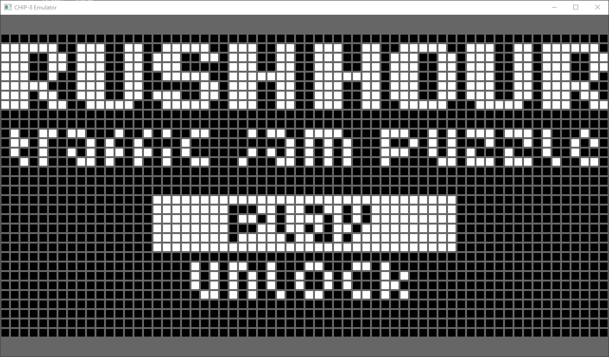
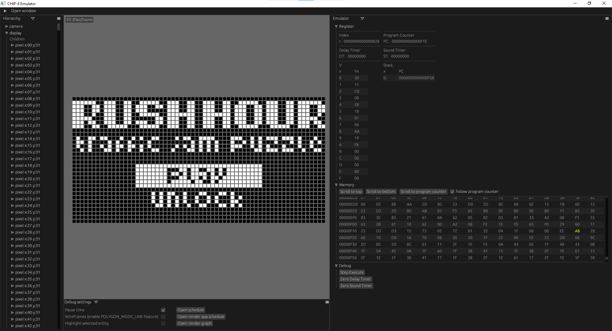

# CHIP-8 Emulator

CHIP-8 emulator built using [Bevy Game Engine](https://bevyengine.org/)

## Screenshot





## Controls

| Keyboard | Action                             |
| -------- | ---------------------------------- |
| ESC      | Exits emulator                     |
| F1       | Opens editor (`editor` build only) |
| 1        | Keypad 1                           |
| 2        | Keypad 2                           |
| 3        | Keypad 3                           |
| 4        | Keypad C                           |
| q        | Keypad 4                           |
| w        | Keypad 5                           |
| e        | Keypad 6                           |
| r        | Keypad D                           |
| a        | Keypad 7                           |
| s        | Keypad 8                           |
| d        | Keypad 9                           |
| f        | Keypad E                           |
| z        | Keypad A                           |
| x        | Keypad 0                           |
| c        | Keypad B                           |
| v        | Keypad F                           |

| Mouse         | Action                             |
| ------------- | ---------------------------------- |
| Drag and Drop | Loads dropped file as a CHIP-8 rom |

## Development

```terminal
cargo run --features "dynamic editor"

# development/debug features:
# dynamic:    # dynamic linking for faster compile-times
# editor:     # editor-like interface
```

## Release

```
cargo run --release
```
